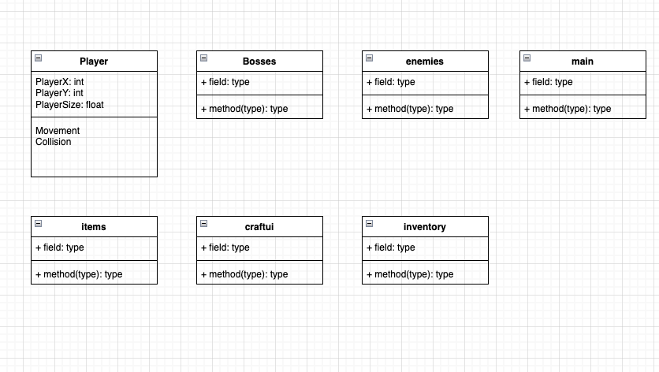
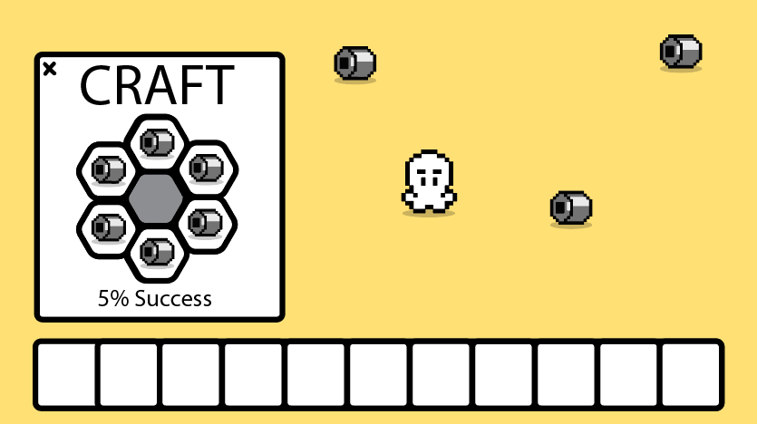
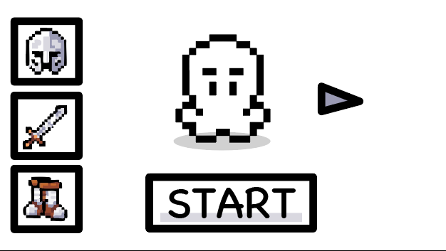
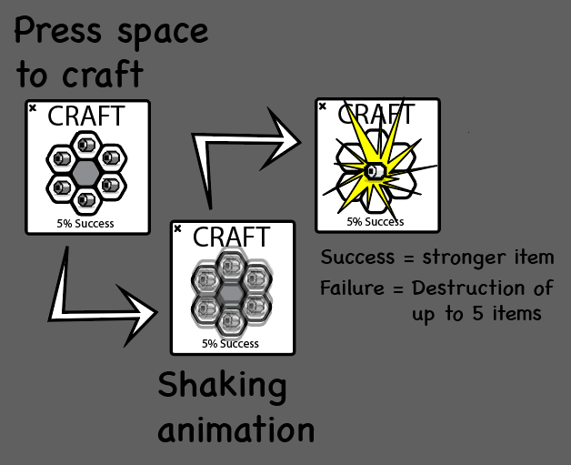

# TapeQuest

## Description:
Tape Quest is a top-down, single-player RPG where players collect characters and craft equipment using various types of tape, each with distinct properties affecting gameplay. The game features a gacha system for acquiring characters, a high-risk crafting system for weapons and armor, and strategic combat against AI-controlled enemies in an open-world environment. It is designed to be extensible for future online account integration and multiplayer features.

Ran via Processing.

## Year 2 concepts:

Collections — ArrayList<Enemy>

Enhanced for loop — for (Enemy e : enemies)

Exception handling — try/catch in ScoreManager

File I/O — BufferedReader / PrintWriter in ScoreManager

Multiple classes with logical responsibilities

Inheritance — Player extends Entity, Enemy extends Entity

x, y — position on screen
radius — size of the circle
bx, by, bw, bh — the map boundary values used for clamping

Abstract class — Entity

Interface — Drawable

## Class Diagram:

## Gameplay:

## Start Screen:

## Crafting UI

